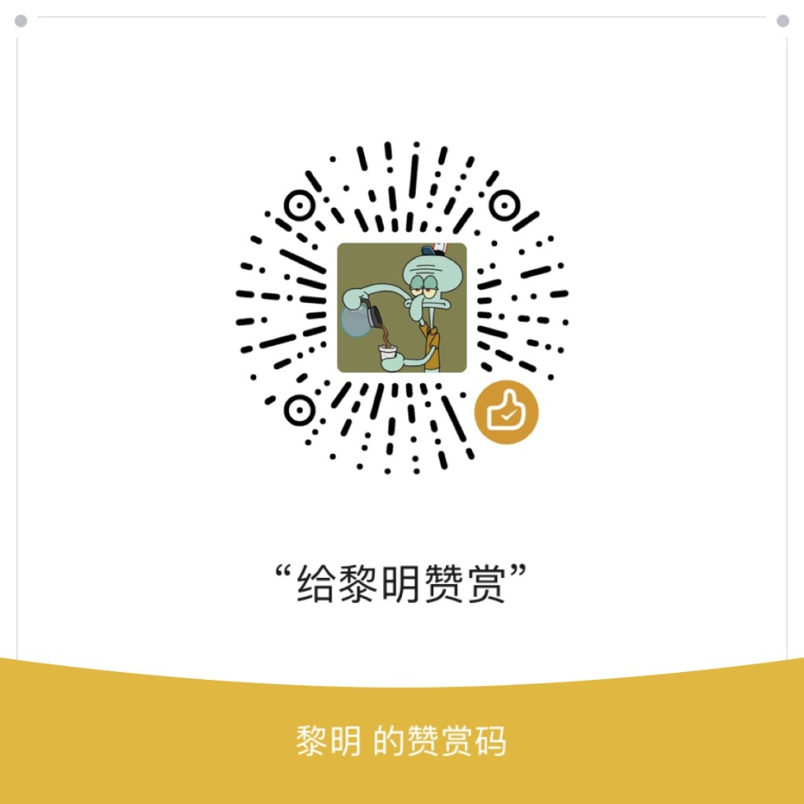

# 🥕 萝卜 WebP 大师 (Radish WebP Optimizer)

<p align="center">
  
  
  
  
  
  
  
</p>

<p align="center">
  <a href="https://github.com/kekeradish/radish-webp-optimizer/releases/latest/download/radish-webp-optimizer.zip">
    
  </a>
</p>

> **出品人**：微信公众号 **【求知的萝卜】**  
> **定位**：专为站长与性能极客打造！集「原图智能量化瘦身 + WebP 终极二次优化 + SEO 极速加速 + 服务器资源暴省」于一体的 WordPress 高性能开源插件。

---

## 🚀 为什么你需要「萝卜 WebP 大师」？

在现代网站运营中，**图片通常占据了整站 70% 以上的带宽与磁盘空间**。臃肿的图片会导致：
* ❌ 页面加载缓慢，Google **LCP (最大内容绘制)** 评分飙红，严重拖累 SEO 搜索排名；
* ❌ 移动端访客由于加载等待流失，网站跳出率居高不下；
* ❌ 服务器磁盘被相机/设计大图快速撑爆，云厂商磁盘与 CDN 流量账单高企；
* ❌ 市面上的图片压缩插件大多按张收取高昂的 API 月费，且存在数据外泄风险。

**🥕 萝卜 WebP 大师** 采用全新的**本地双重优化架构**，彻底解决以上所有痛点！

---

## 🌟 核心特性与技术优势

### 1. ⚡ 独创双重优化架构 (Dual-stage Optimization)
* **阶段一（原图智能脱水瘦身）**：在图片上传落盘的第一秒，采用 TinyPNG 同款原理的 **256 色智能色彩量化（Color Quantization）** 与 **4:2:0 色度抽样**，自动剔除无用的 EXIF/GPS/相机元数据，**原图自身体积立减 60%~75%**，大幅减轻服务器磁盘存储负担！
* **阶段二（WebP 终极二次转码）**：基于瘦身后母本生成超轻量的 `.webp` 终极副本，**前台传输体积暴降 80%~95%**，肉眼视觉几乎 0 损失。

### 2. 📈 搜索引擎 SEO 与 Core Web Vitals 性能飞跃
* **LCP (最大内容绘制) 极限压榨**：使首屏大图从 2MB 骤降至 100KB~200KB，加载耗时从 3.5 秒压缩至 0.4 秒，助你轻松拿下 Google Lighthouse 绿色优秀评分；
* **提升搜索引擎权重与抓取效率**：更小的页面体积使 Googlebot、百度蜘蛛能以更快的速度爬取更多页面，显著提升收录速度与自然搜索排名；
* **100% 搜索引擎友好的 `<picture>` 规范**：现代浏览器秒开 WebP，老旧爬虫与未兼容设备自动 Fallback 回退瘦身原图，绝无破图风险。

### 3. 💾 服务器硬件资源与 CDN 流量开销暴减
* **云盘存储节省 70%+**：彻底告别媒体库动辄几十 GB、云服务器云盘天天告警扩容的窘境；
* **服务器吞吐量 (QPS) 提升 5 倍**：相同的 5Mbps / 10Mbps 带宽下，可同时承载 5~8 倍的并发访客，避免 Apache / Nginx 静态并发连接数被大图堵死；
* **CDN 流量账单立减 80%**：无论是阿里云、腾讯云、又拍云、七牛云还是 Cloudflare，流量支出直接断崖式下降；
* **零外部 API 费用 & 100% 隐私安全**：完全依靠服务器本地 `ImageMagick` 或 `GD` 驱动，无限张数免费转换，图片无需上传到第三方服务器。

### 4. 🖥️ 全屏宽屏大模态弹窗工作台 (Modal UI)
* 告别狭窄边栏，一屏全景浏览全站媒体库；
* 彻底杜绝横向左右滑动，排版自适应一览无余；
* 高清缩略图支持 **点击弹出大图灯箱（Lightbox）**，1:1 细致核验画质；
* 支持【全选】、【取消全选】、【仅选未优化图片】等批量多选异步队列处理。

### 5. 🛡️ 原始母本安全备份与一键恢复
* 可选在瘦身前保留原始备份文件（`.radish_bak`）。若后续需要取回最初未压缩原图，在媒体库随时支持**一键【恢复最初原图】**。

---

## 📊 优化前后真实效果对比

| 图片类型 | 原始上传大小 | ① 原图瘦身后 (JPG/PNG) | ② WebP 终极优化 | 综合体积减小 | 视觉质量 |
| :--- | :--- | :--- | :--- | :--- | :--- |
| **相机摄影 JPG** | `4.2 MB` | `1.1 MB` (-73%) | **`280 KB`** | **-93.3%** | 视觉无损 ⭐⭐⭐⭐⭐ |
| **高清截图 PNG** | `1.8 MB` | `460 KB` (-74%) | **`185 KB`** | **-89.7%** | 极其清晰 ⭐⭐⭐⭐⭐ |
| **Banner 横幅** | `2.6 MB` | `680 KB` (-73%) | **`190 KB`** | **-92.6%** | 细腻保真 ⭐⭐⭐⭐⭐ |

---

## 📦 安装与使用指南

### 方法一：上传 ZIP 压缩包安装（推荐）
1. 在本项目根目录或 Releases 下载最新 `radish-webp-optimizer.zip`；
2. 登录 WordPress 管理后台，进入 **【插件】 $\rightarrow$ 【安装插件】 $\rightarrow$ 【上传插件】**；
3. 选择 zip 文件上传并点击 **【现在安装】**，安装完成后点击 **【启用插件】**。

### 方法二：Git Clone 部署
将本项目克隆至 WordPress 的 `wp-content/plugins/` 目录：
```bash
cd wp-content/plugins/
git clone https://github.com/kekeradish/radish-webp-optimizer.git
```
进入 WordPress 后台在【已安装的插件】中点击启用。

---

## ⚙️ 极速配置建议

进入 WordPress 后台 **【设置】 $\rightarrow$ 【🥕 萝卜 WebP 大师】**：
- **原图压缩质量**：推荐 `82% ~ 85%`（已内置 256 色智能量化与 4:2:0 抽样，画质极高且体积暴减）；
- **WebP 压缩质量**：推荐 `80%`（黄金性能平衡点）；
- **原图最大分辨率限制**：推荐 `2560px`（自动等比缩小相机 4K/6K 巨幅原片，防止撑爆服务器）；
- **输出模式**：推荐 `HTML5 <picture> 模式`。

---

## 🔧 系统运行环境要求

- **WordPress 版本**：5.0 或更高版本
- **PHP 版本**：7.2 或更高版本（推荐 PHP 8.0+）
- **图像处理扩展**：
  - `ImageMagick`（`imagick` 扩展且支持 WebP，强烈推荐）
  - 或 `GD` 扩展（内置 `imagewebp` 支持）

---

## ☕ 请作者喝杯咖啡 (Buy Me a Coffee)

如果您觉得「**🥕 萝卜 WebP 大师**」切实帮您的网站节省了服务器磁盘和 CDN 流量费用、大幅提升了网页加载速度，欢迎扫码请作者喝杯咖啡 ☕！

您的每一份支持，都是激励作者持续开源维护与迭代新特性的最大动力 ❤️！

<p align="center">
  
</p>

---

## 📄 开源许可证

本项目基于 [GPL v2.0](LICENSE) 开源协议。

---

## 关注作者

欢迎关注微信公众号：**【求知的萝卜】**  
第一时间获取更多极客工具、WordPress 深度调优与硬核效率干货！


